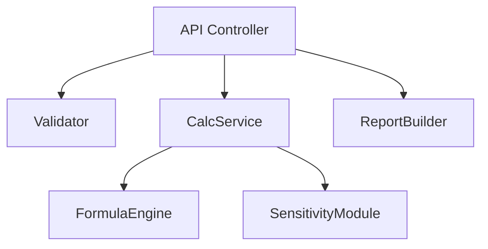

# C4 — Level 3: Component Diagram

```mermaid
flowchart TD
    Controller[API Controller] --> Validator[Validator]
    Controller --> CalcService[CalcService]
    Controller --> ReportBuilder[ReportBuilder]
    CalcService --> FormulaEngine[FormulaEngine]
    CalcService --> SensitivityModule[SensitivityModule]
```
