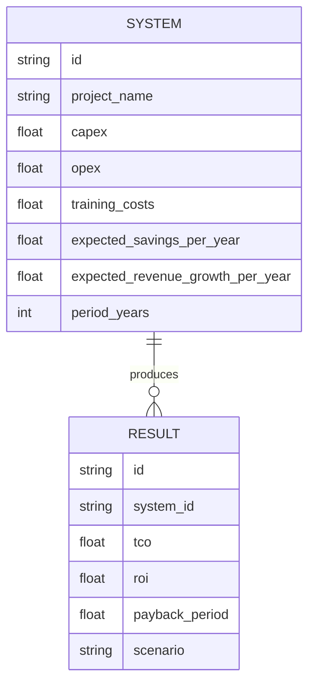

# ER-диаграмма InvestCalc

```mermaid
erDiagram
    SYSTEM {
        string id
        string project_name
        float capex
        float opex
        float training_costs
        float expected_savings_per_year
        float expected_revenue_growth_per_year
        int period_years
    }

    RESULT {
        string id
        string system_id
        float tco
        float roi
        float payback_period
        string scenario
    }

    SYSTEM ||--o{ RESULT : produces
```
