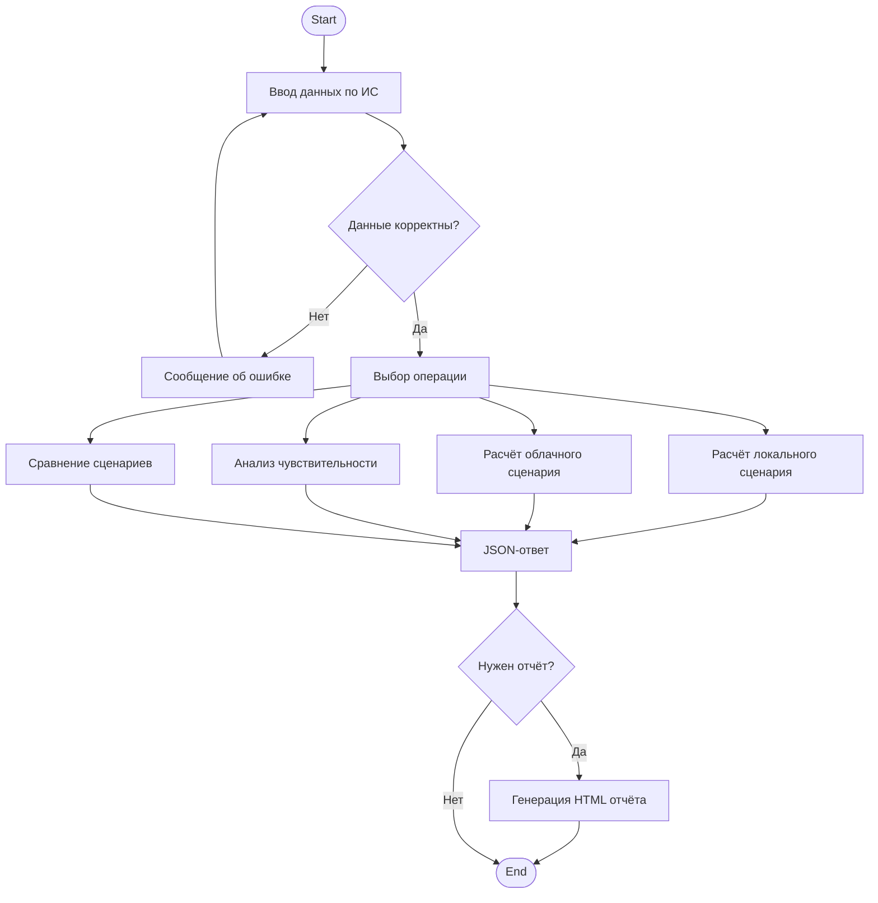

# User Flow — InvestCalc

```mermaid
flowchart TD
    Start([Start]) --> Input[Ввод данных по ИС]
    Input --> Validate{Данные корректны?}
    Validate -- Нет --> Error[Сообщение об ошибке] --> Input
    Validate -- Да --> Choice[Выбор операции]
    Choice --> Local[Расчёт локального сценария]
    Choice --> Cloud[Расчёт облачного сценария]
    Choice --> Sensitivity[Анализ чувствительности]
    Choice --> Compare[Сравнение сценариев]
    Local --> Output[JSON-ответ]
    Cloud --> Output
    Sensitivity --> Output
    Compare --> Output
    Output --> Report{Нужен отчёт?}
    Report -- Да --> Gen[Генерация HTML отчёта] --> End([End])
    Report -- Нет --> End
```
